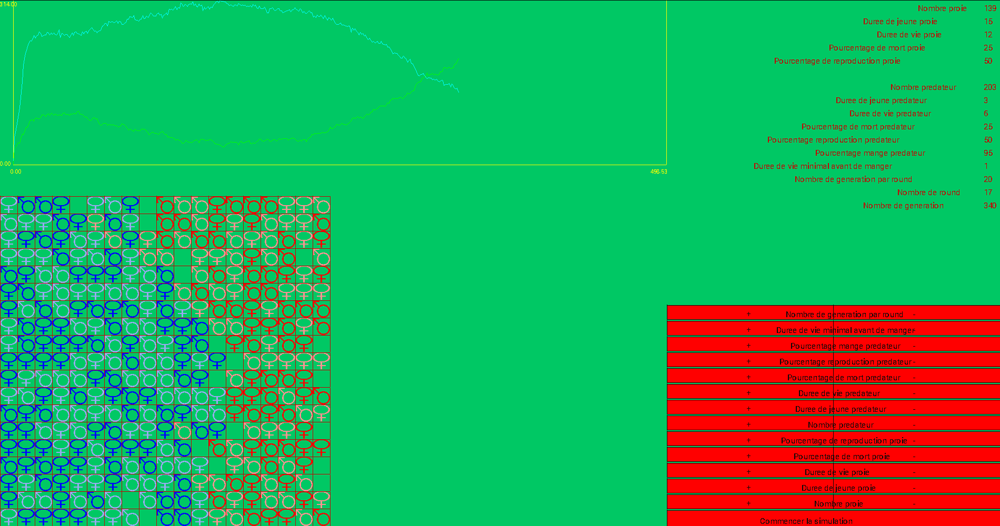

# Projet Proie prédateur

**Ben Hassen Maxime**

## But du projet

Ce projet a pour but de faire un système proie prédateur _le plus poussé possible_ à l’aide de la bibliothèque _[Grapic](https://perso.liris.cnrs.fr/alexandre.meyer/grapic/html/index.html)_ (basé sur [SDL2](https://libsdl.org/)).
Mon but est également de mettre en place un environnement de développement assez complet avec des scripts permettant de faire facilement les actions récurrentes, mais également de le documenté. [Code source](https://github.com/Da-max/grapic) (github).

Le projet, en particulier, contient un certain nombre de variable de configuration qui sont modifiables depuis le code, mais aussi et surtout depuis l’interface graphique.

### Exemple au 1 mai

_Avec les données initiales suivantes :_

- Nb proie : 45
- Nb prédateur : 30

### En savoir plus

Afin de comprendre le fonctionnement de l’interface et de l’évolution de l’écosystème, merci de consulter le [wiki](https://github.com/Da-max/grapic/wiki).

**J’ai utilisé les pointeurs car je pense que mon code serait devenu trop brouillon sans. J’ai limité son utilisation aux boutons. Par souci de transparence, voici où j’ai trouvé le code utilisé : [C - function inside struct - Stack Overflow](https://stackoverflow.com/questions/17052443/c-function-inside-struct/17052566#17052566)**

## Structure

- Le dossier `data` contient toute les images servant au fonctionnement du projet.
- Le dossier `script` contient les scripts servant à facilité les actions récurrentes du projet. _Attention ces scripts ne fonctionnent que sur Linux._

### Structure et fonctionnement du code `main.cpp`

Globalement, j’ai essayé de séparer mon code en grandes parties qui sont les suivantes (dans l’ordre) :

- _CONST_ qui contient les constantes utiles à l’application.
- _STRUCTS_ qui contient les structures de l’application.
- _OPERATORS HEADERS_ qui contient l’entête des quelques opérateurs (car je m’en servais dans la partie getters, or, certains operators utilisent ces getters).
- _GETTERS_ qui contient des fonctions plutôt simple qui donnent des informations sur les éléments du programme.
- _MAKE FUNCTIONS_ qui contient les fonctions permettant de créer une instance des structures.
- _OPERATORS_ qui définis des opérateurs entre des éléments du programme.
- _UTILS FUNCTIONS_ qui contient des fonctions utilitaires afin de calculer des choses ou des faire des actions simples sur les structures.
- _UPDATE FUNCTIONS_ qui contient les fonctions mettant à jour différents éléments de l’écosystème. En particulier, c’est dans cette partie que se trouve les fonctions appelées par les boutons.
- _INIT FUNCTIONS_ permettant d’initialiser les structures, quand celles-ci peuvent l’être _sans question à l’utilisateur_.
- _CONFIG FUNCTIONS_ qui contient les fonctions permettant la configuration des structures _en posant des questions à l’utilisateur_.
- _DRAW FUNCTIONS_ contenant les procédures permettant d’afficher les éléments du programme.

## Comment utiliser

### À partir des sources

- Cloner le dépot `git clone https://github.com/Da-max/grapic`
- Se rendre dans le dossier `cd grapic`
- Lancer le build et run avec `make start`

### À partir du zip

- Extraire le projet `unzip main_project.zip`
- Déplacer le contenu de `data` dans `./data/img/main_project` (ou modifier dans le `main.cpp` le chemin vers les images)
- Déplacer le `main.cpp` dans le dossier de son choix et ajouter ce chemin dans `premake4.lua`
- Compiler `make <nom_du_projet>`
- Lancer `bin/<nom_du_projet`

## Avancement

### Avancement au 02 avril

Début du projet, pour l’instant très classique. Pas séparé en plusieurs fichiers.

- De nombreuses erreurs doivent restées, j’ai défini uniquement quelques structures et quelques fonctions utilitaires.
- Le code est contenu uniquement dans `main.cpp`.

### Avancement au 9 avril

_Suite du projet, pas grand chose de plus._ À ce stade, mon projet compile, cependant il me reste un bug (que je n’arrive toujours pas à résoudre) : si je ne passe pas mes structures par référence,
j’obtiens une erreur (_segmentation erreur_).

- Définition de structures complémentaires et quelques fonctions afin de créer/confiurer ces structures.
- Modification du makefile afin d’automatiser quelques opérations (build+run et zip).
- Définition d’autres getters afin d’obtenir facilement des informations sur les individus (sexe, herb, proie, prédateur, etc…).
- Ajout de deux fonctions d’affichage

#### TODO

- **Régler le problème de pointeurs** (-> me documenter d’avantage sur le fonctionnement des pointeurs).
- Commencer les fonctions d’updates.
- Trouver et ajouter d’autres images (en fonction du genre et nombre de jours de vie).
- Essayer de séparer en plusieurs fichiers (?)

### Avancement au 16 avril

_Suite du projet, ajout de quelques fonctions qui d’update._

- Correction du problème avec les images.
- Ajout de fonctions d’update.
- Ajout d’image (qui ne me conviennent pas).

#### TODO

- Modifier les images (remplacer par des carrés/triangles ?).
- Mettre en place des boutons afin d’avancer dans l’évolution.
- Essayer de faire des prédictions grâce aux fonctions de Lotka.

### Avancement au 1 mai

_Proche de la fin du projet. Les fonctions principales ont été faîtes !_

- Correction de différent bug, lié au choix des cases lors des mises à jour.
- Ajout des boutons afin de modifier écosystème.
- Ajout des plots pour visualiser l’évolution du nombre d’individus dans l’écosystème.
- Mise à jour du README pour ajouter une image d’exemple et un lien vers le wiki.

#### TODO

- Un projet n’est jamais fini…:smile: !
